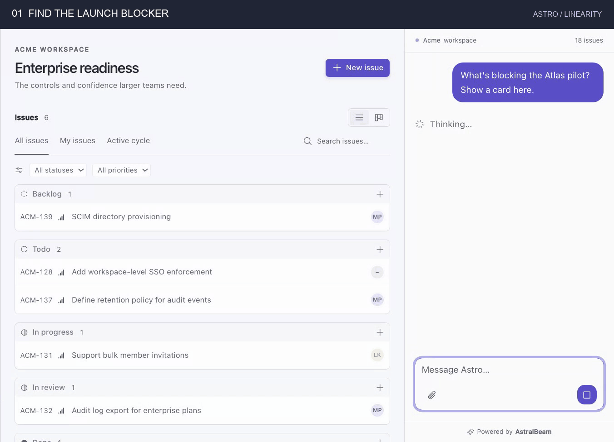

# AstralBeam

[](https://www.npmjs.com/package/@astralbeam/sdk) [](#licensing) [](https://discord.gg/suehFycUvW)

**Links:** [Website](https://astralbeam.ai) · [Docs](https://app.astralbeam.ai/docs) · [Discord](https://discord.gg/suehFycUvW) · [Cloud](https://app.astralbeam.ai)



[AstralBeam](https://astralbeam.ai) is the agentic chat widget for your app. Drop a Cursor-style agent sidebar into your product. It streams answers, calls your tools, renders your components, and works with users' files. Self-host it or use [AstralBeam Cloud](https://app.astralbeam.ai).

## How it works

Integration takes three steps. Each one is a few lines of code and unlocks the next layer of the platform. Items marked _in progress_ are on the roadmap and not shipped yet.

### 1. Add the frontend SDK

```sh
npm install @astralbeam/sdk
```

```tsx
import { AstralBeamChat } from "@astralbeam/sdk/react"

export function Sidebar() {
  return <AstralBeamChat title="Acme Assistant" />
}
```

You get a Cursor-style agentic chat sidebar with a managed backend, full customization of copy, colors, and slots, users' file attachments, coding sandboxes with downloadable artifacts, and resumable streaming (in progress).

### 2. Identify your users

Your server already knows who is signed in. Mint a short-lived token that carries the user and their tenant, and the widget picks it up. API keys never reach the browser.

```ts
import { createAstralBeamToken } from "@astralbeam/sdk/server"

export async function POST(request: Request) {
  const session = await getSession(request)
  const token = await createAstralBeamToken({
    apiKey: process.env.ASTRALBEAM_API_KEY,
    user: { id: session.user.id, name: session.user.name },
    tenant: { id: session.org.id, name: session.org.name },
  })
  return Response.json({ token })
}
```

You get per-customer and per-user rate limits and tenant isolation, plus conversation history, usage tracking, Stripe-metered billing, and one-click observability (in progress).

### 3. Hook up tools and widgets

Declare what the agent can do and what it can draw. Tools run in your page against your own state. Widgets render your components inside the reply.

```tsx
<AstralBeamChat
  tools={{
    refundOrder: defineTool({
      description: "Refund an order and notify the customer",
      parameters: z.object({ orderId: z.string() }),
      execute: ({ orderId }) => api.refund(orderId),
    }),
  }}
  widgets={{
    orderCard: defineWidget({
      description: "Show an order's status and total",
      parameters: z.object({ orderId: z.string() }),
      render: ({ orderId }) => <OrderCard id={orderId} />,
    }),
  }}
/>
```

The agent can read user data, take actions inside your app, render interactive widgets in its replies, and ask before acting. Exposing the same tools over MCP, so users can drive your app from Claude or ChatGPT, is in progress.

AstralBeam works with your existing LLM providers and gateways, observability platforms, and coding sandbox providers. The SDK is MIT licensed and the platform is AGPL-3.0. Start with the [docs](https://app.astralbeam.ai/docs).

## Codebase Structure

There are six independent Deno projects: a TanStack Start product application with app-local shadcn/ui components, the prerendered TanStack Start marketing website, the frontend SDK published to npm, the organization admin CLI published to npm and as Deno binaries, and two standalone TanStack Start examples that consume the built SDK. [Linearity](examples/linearity-react) is a multi-workspace project tracker with an embedded Astro assistant. The todos example keeps the integration minimal.

```text
platform/       # TanStack Start application, database, theme, and UI
www/          # Public website
sdk/          # Frontend SDK, published to npm as @astralbeam/sdk
cli/          # Organization admin CLI, published to npm as @astralbeam/cli
examples/     # Standalone SDK consumer applications
```

## Local development

Run the applications natively with Deno and the database services through Docker Compose or Podman Compose. See [Setup](SETUP.md) for one-time prerequisites.

### Start PostgreSQL and Mailpit

Compose starts PostgreSQL, PgBouncer, Valkey, and Mailpit. The default `DATABASE_URL` in [`platform/.env.development`](platform/.env.development) points at PgBouncer, the only database endpoint published to the host. On macOS, run Deno natively and use Compose for these services.

From the repository root, start the services with Docker:

```sh
docker compose up --detach --wait
```

Or use Podman, then wait for the services to become healthy:

```sh
podman compose up --detach
podman compose ps
```

Mailpit captures outgoing email on SMTP port 1025. Read it in the [local inbox](http://localhost:8025) on port 8025.

### Set up the projects

Install dependencies, migrate, seed local data, and build the SDK:

```sh
./scripts/setup.sh
```

The [seed](platform/src/db/README.md#seed-sample-data) creates local accounts and credentials and writes `examples/todos/.env` and `examples/todos-rails/.env` only when absent. Bootstrap defaults are in [`platform/.env.development`](platform/.env.development). Manage runtime settings at `/configure` using the first `DATABASE_ENCRYPTION_KEY` value.

### Chat credentials

Chat runs on the organization's own OpenAI API key, which owners set in the dashboard under **Settings**. Put a key of your own in `platform/.env.local` and the seed gives it to every seeded organization:

```sh
OPENAI_API_KEY=sk-...
```

### Run everything

```sh
deno task dev
```

This starts the four dev servers and the SDK watcher together:

- <http://localhost:4500>, the product application and its `/api/v1/chat` agent endpoint
- <http://localhost:4600>, the public website
- <http://localhost:4800>, Linearity with projects, issues, cycles, and Astro. Set its Basic Auth credentials first using [the example setup](examples/linearity-react/README.md)
- <http://localhost:4700>, the todos example with the embedded widget. See [`examples/todos/README.md`](examples/todos/README.md) for what to try

The Ruby on Rails version of the example runs separately with `bin/setup` from `examples/todos-rails` and opens on <http://localhost:3000>. See [`examples/todos-rails/README.md`](examples/todos-rails/README.md).

Reload the page after changing SDK sources: the watcher rewrites the `sdk/dist` output the example imports.

### Project commands

Run from the repository root:

```sh
deno task install  # all project dependencies
deno task dev      # all apps and the SDK watcher
deno task build    # all projects, SDK first
```

Per-project aliases include `deno task dev:platform`, `deno task build:sdk`, and `deno task install:todos`. Other tasks use `deno task --cwd <project> <task>`. Run `deno task` to list root commands.

For account creation and email delivery, follow [Authentication setup](SETUP.md#authentication-and-transactional-email).

## Licensing

Portions of this repository are licensed as follows:

- Files under [`www`](www), [`sdk`](sdk), and [`examples`](examples) are licensed under the [MIT License](LICENSE-MIT), except for third-party material governed by its applicable license.
- All other files in this repository are licensed under the [GNU Affero General Public License v3.0 only](LICENSE-AGPL) (`AGPL-3.0-only`), except where an adjacent license or notice states otherwise.
- Third-party components and materials are licensed under the applicable licenses provided by their respective owners. See [third-party notices](docs/legal/THIRD_PARTY_NOTICES.md).

Copyright © 2026 AstralBeam Inc. for AstralBeam-controlled material. Third-party material remains subject to its respective copyright and license terms.
