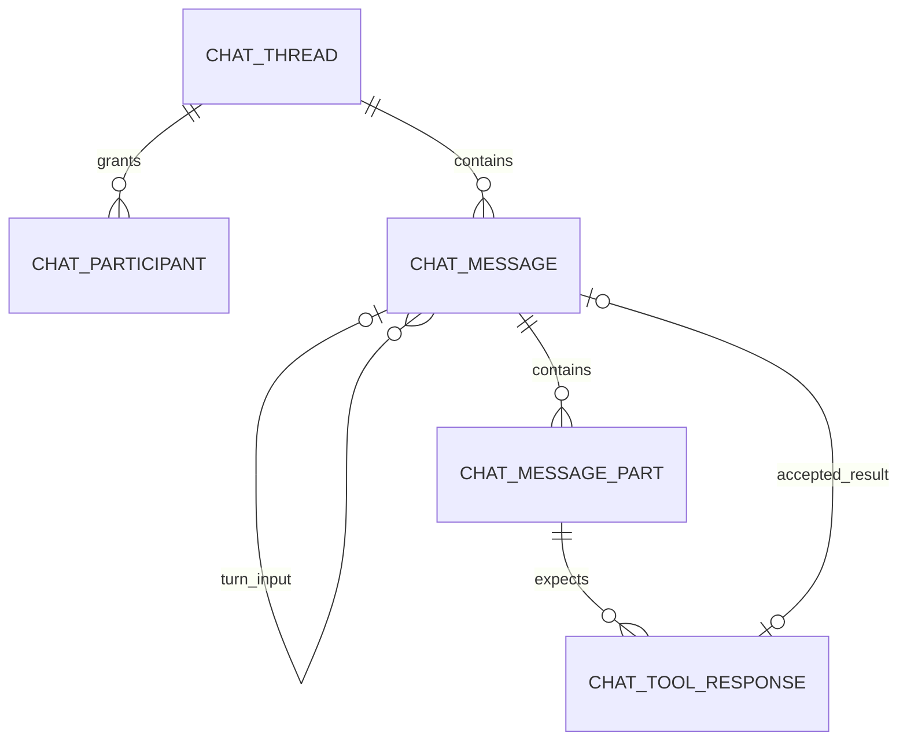

# Chat persistence

AstralBeam stores every chat in PostgreSQL. Let's follow a shared conversation from participant access through message admission, model execution, tool responses, and reopening saved history.

This guide describes the implemented foreground execution model. Saved history survives reloads and restarts. Generation remains attached to its HTTP request, so persistence does not imply background recovery or stream replay.

## Code map

| File | Responsibility |
| --- | --- |
| [Database schema](../../db/schema/chat.ts) | Tables, enums, indexes, and scoped foreign keys. |
| [Stored JSON contracts](../../db/schema/chat.ts) | Validated message metadata and content payloads. |
| [Service contracts](threads/schemas.ts) | Conversation principals, execution identities, and history projections. |
| [Conversation service](threads/threads.ts) | Authorization, transactions, ancestry, participants, admission, and state transitions. |
| [Commands](threads/commands.ts) | Validated user input, shared platform idempotency, and tool-result validation. |
| [Projection](threads/projection.ts) | Stored history converted into valid provider context. |
| [Streaming integration](threads/stream.ts) | TanStack persistence, checkpoints, tool gates, and saved acknowledgments. |
| [Chat execution](chat.ts) | Agent configuration, model orchestration, attachments, and sandbox preparation. |
| [Conversation HTTP contract](../../routes/api/v1/chat/-lib/threads.server.ts) | Resource endpoints and REST encoding. |
| [SDK session](../../../../sdk/src/core/session.ts) | Authentication, selection, hydration, drafts, transport, and interaction restoration. |

The [architecture document](../../../../ARCHITECTURE.md#saved-conversations) explains the wider design and research references. [Chat instructions](AGENTS.md) define implementation invariants. The [database guide](../../db/README.md) owns migration and query conventions.

## Scope and access

An Organization is an AstralBeam customer, typically a SaaS application. A Tenant is one of that Organization's customer accounts. A TenantUser is an end user of that Tenant. Organization dashboard users and TenantUsers are separate identities.

A thread belongs to one Organization and Tenant. Access comes from explicit participant grants within that Tenant. Creation gives the requesting TenantUser a manager grant, without establishing a permanent owner.

| Participant role | Permissions |
| --- | --- |
| `viewer` | Read metadata, history, participants, and saved attachments. |
| `member` | Viewer permissions, plus send messages and submit permitted tool responses. |
| `manager` | Member permissions, plus rename, delete, search same-Tenant users, and manage participants. |

All authenticated browser clients of a TenantUser share that user's grant. A tool response can additionally target one browser instance. Tenant administration or Organization dashboard membership does not grant participant permissions. Separate administrative directory endpoints allow Organization directory readers and signed Tenant admins to read metadata, saved transcripts and uploads within their verified scope. Removing a participant preserves their historical authorship, and the service prevents removing or demoting the last manager.

## Schema

Five tables separate entities with independent 1:N relationships. A turn stays on its initiating user message, and a tool decision stays on its content part. Neither needs a separate 1:1 table.



The part-to-response relationship applies to tool decisions. Ordinary text, attachment, and presentation parts have no response rows. A new assistant draft can initially have zero parts.

### Common columns

Every table has the following columns. Messages and message parts use primary key `(organization_id, tenant_id, thread_id, id)`. The other tables use `(organization_id, tenant_id, id)`.

| Column            | Meaning                                                         |
| ----------------- | --------------------------------------------------------------- |
| `organization_id` | Immutable Organization boundary.                                |
| `tenant_id`       | Internal Tenant UUID, scoped to that Organization.              |
| `id`              | Stable application UUID, with a database `uuidv7()` default.    |
| `created_at`      | Creation instant, using `timestamptz` and `now()` by default.   |
| `updated_at`      | Last persisted update, using the shared `timestamps()` builder. |

UUIDs identify records. They do not establish transcript order. Composite foreign keys carry Organization, Tenant, and, where necessary, thread scope. An agent reference carries Organization scope because agents belong to Organizations.

`timestamps()` updates `updated_at` through a Drizzle runtime hook. A raw SQL update must set it explicitly. The PostgreSQL minimum is 18, which supplies `uuidv7()`.

### `chat_thread`

A thread stores shared metadata and the leaf of its default history path. Code and REST contracts use thread consistently, including `thread_id` and `threadId`. User-facing copy calls it a conversation. A turn represents accepted input and its resulting activity, while a run identifies one execution within that thread.

| Column beyond the common fields | Meaning and use |
| --- | --- |
| `agent_id` | Selected Organization-owned agent, bound at creation. Later default-agent changes do not replace it. Agent deletion clears the reference, leaving history readable while preventing new generation. |
| `title` | Editable label. Empty means the generic client label. Admission initializes an empty title from the first user input when possible. Explicit titles and later renames are preserved. |
| `current_leaf_message_id` | Last node on the default selected history path. Null means empty history. Following parent links from this node reconstructs that path. |
| `lock_version` | Optimistic revision for metadata, membership, and deletion commands. New sends append without a client version precondition. |

Thread lists sort by `updated_at` and ID. Appends, renames, and membership changes count as activity. Token checkpoints update message content without updating the thread. There is no separate `last_message_at`, owner, creator, message sequence, or conversation-wide execution claim.

Empty threads remain addressable but are excluded from saved-history lists. The SDK creates the database resource on the first send, so selecting “new conversation” alone does not fill the list with empty entries.

### `chat_participant`

A participant row grants one TenantUser access to one thread. It is an access relationship, separate from who authored a message or executed a tool.

| Column beyond the common fields | Meaning and use |
| --- | --- |
| `thread_id` | Thread receiving the access grant. |
| `tenant_user_id` | Internal same-Tenant user receiving access across their clients. |
| `role` | PostgreSQL enum `chat_participant_role`: `viewer`, `member`, or `manager`. |

The scoped thread/user pair is unique. Participant list names and external IDs come from TenantUser records, so they are not duplicated on the grant.

### `chat_message`

A message is a transcript node. It holds authorship and ancestry, with its content stored in ordered part rows. An initiating user message also holds its turn lifecycle.

| Column beyond the common fields | Meaning and use |
| --- | --- |
| `thread_id` | Owning thread and deletion boundary. |
| `parent_message_id` | Immediately preceding node on this history path. Null for a root. Assigned on insertion and never changed. |
| `turn_message_id` | Initiating user message for assistant and tool messages. Null on user inputs. This links causal activity even when other participants append between its messages. |
| `author_tenant_user_id` | Human author or browser-result submitter. Null for assistant messages and server-produced results. |
| `role` | PostgreSQL enum `chat_message_role`: `user`, `assistant`, or `tool`. |
| `state` | PostgreSQL enum `chat_message_state`: `draft`, `complete`, or `interrupted`. Only assistant messages can be draft or interrupted. |
| `metadata` | Validated execution and provider context, separate from visible content. Includes the current invocation ID and allowlisted provenance. |
| `turn_state` | PostgreSQL enum `chat_message_turn_state`: `running`, `waiting`, `completed`, or `interrupted`. Populated only on the initiating user message. |

A user input remains `state = complete` when its response is waiting or interrupted. Message state describes saved content, while turn state describes activity caused by that input. A complete assistant decision can still await a browser response.

The database permits at most one draft per initiating turn. Several turns in a thread can each have a draft. Accepted user content, finalized assistant content, and accepted tool results are immutable. A continuation changes the input's invocation metadata and turn state without rewriting its content.

### `chat_message_part`

A part is one ordered unit of message content: text, reasoning presentation, an upload, a tool decision, a tool result, or supported declarative presentation. This table covers the complete transcript, so naming it `chat_tool_part` would exclude much of its purpose.

| Column beyond the common fields | Meaning and use |
| --- | --- |
| `thread_id` | Thread scope for queries and same-thread response references. |
| `message_id` | Message containing this part. |
| `position` | Explicit zero-based order inside the message. Nonnegative and unique within the scoped message. It has no default, and gaps are allowed. |
| `payload` | Validated, versioned structured content. Tool declarations and original accepted upload bytes stay here. |
| `execution_location` | Where a tool decision should execute: `server_api`, `sandbox`, or `browser`, using PostgreSQL enum `chat_message_part_execution_location`. Specific responders live in `chat_tool_response`. Populated only for tool-decision parts. |

The row ID is the stable application part identity. Stored JSON does not duplicate `id`, `executionLocation`, or response `targets`. The service adds those fields when assembling transport payloads. Identities remain stable across checkpoints, including when upstream message identifiers repeat. Draft positions can change when final provider output introduces parts omitted by streaming snapshots, such as reasoning before text. Completed content remains immutable.

### `chat_tool_response`

Each row represents one expected response to a committed tool-decision part. It is created before execution, rather than after a result arrives. The actual result lives in a separate immutable tool message and its content part.

| Column beyond the common fields | Meaning and use |
| --- | --- |
| `thread_id` | Same-thread scope for the decision and accepted result. |
| `tool_part_id` | Tool-decision part requiring this response. |
| `tenant_user_id` | Intended human responder, when the decision targets a user. |
| `client_id` | Intended browser instance, when execution targets a particular client. It is routing identity, not an authentication credential. |
| `result_message_id` | Accepted tool-result message or explicit closure. Null means outstanding, not failed. |

Current server API and sandbox tools create one untargeted response slot. Browser tools create one slot for the initiating TenantUser and client. The schema also supports several slots per decision, including two different clients of one user. Registration and production delivery to several clients remain deferred.

A decision finishes when all its response slots have results. Each result message can fill only one slot. Recipient identity and actual result authorship are separate facts. `succeeded`, `failed`, `skipped`, and `unknown` outcomes live in the result payload, so a populated result reference does not itself prove success.

The public `response_target_id` is this row's ID. Public source-message and source-part fields are derived through the response, part, and message relationships. They are not duplicate source columns on `chat_message`.

### Constraints and indexes

Foreign keys prevent cross-thread parents, initiating inputs, parts, leaves, and results. Participants, authors, and intended responders reference same-Tenant users. Unique indexes cover participant grants, part positions, one draft per turn, and one response slot per accepted result message.

Database checks enforce role/state combinations, nonnegative part positions, tool-only execution locations, and no direct self-parent or self-turn reference. The service additionally verifies that a parent already exists, ancestry never changes, a turn reference points to a user input, a response references a committed tool decision, and accepted results cannot be replaced. Foreign keys alone cannot establish all those facts or prevent arbitrary ancestry cycles.

Indexes support thread activity, participant access, parent traversal, turn lookup, and expected-response lookup. There is no general JSONB index or materialized `ltree` path. Parent links remain authoritative, and ancestry optimization can be added if complete hydration measurements justify it.

## JSON contracts and stored examples

Both JSONB columns use `schemaJsonb(EffectSchema)`. The Drizzle codec validates ordinary reads, writes, and relational reads. Raw SQL bypasses these codecs, so this is application-boundary enforcement rather than a PostgreSQL JSON Schema constraint.

Format versions are embedded in JSON. Unsupported versions fail explicitly rather than becoming empty content. Metadata has an explicit allowlist, while part payloads use a discriminated union with JSON extension fields. Stored values are bounded. Credentials, JWTs, service instances, callbacks, and entire resolved provider configuration objects do not belong in either column.

### Message metadata

For example, an assistant's `metadata` can contain:

```json
{
  "version": 1,
  "invocationId": "cbd0fdb8-d3b5-4d33-a0af-4c3cc4b8d823",
  "provenance": {
    "agentId": "0199b600-0000-7000-8000-000000000002",
    "initiatorTenantUserId": "0199b600-0000-7000-8000-000000000003",
    "clientId": "386e8524-3de2-4930-8f80-ef5a6d742d79"
  }
}
```

Optional fields also preserve input tool declarations, opaque `modelMessages`, provider instance/type, API protocol, model identity, and usage. Provider continuation data is replayed only with the same provider instance, protocol, and model. Otherwise the adapter uses portable canonical parts.

`initiatorTenantUserId` identifies the actor of this foreground invocation. A participant resolving the last browser response can start a continuation, so that actor can differ from the original user-message author.

### Part payloads

A text part stores content without repeating its row ID or position:

```json
{ "version": 1, "type": "text", "content": "Check the service status." }
```

A tool-decision part preserves provider correlation and arguments. Its row separately has `execution_location = 'browser'`, and its expected response is a `chat_tool_response` row:

```json
{
  "version": 1,
  "type": "tool-call",
  "name": "get_service_status",
  "toolCallId": "call_status_1",
  "arguments": "{\"service\":\"payments\"}",
  "declaration": {
    "name": "get_service_status",
    "inputSchema": {
      "type": "object",
      "properties": { "service": { "type": "string" } },
      "required": ["service"]
    }
  }
}
```

The exact declaration fields come from the accepted tool contract. Arguments are a JSON-encoded string because that is the tool-call representation used by the adapter. Available output schemas are preserved for result validation.

The accepted response's tool message contains a result part:

```json
{
  "version": 1,
  "type": "tool-result",
  "outcome": "succeeded",
  "output": { "service": "payments", "healthy": true }
}
```

The stored union also covers `thinking`, `reasoning`, image/audio/video/document uploads, `structured-output`, `ui-resource`, and `subagent` content. These content types do not by themselves enable background delegation or durable artifact storage.

## Transcript order, turns, and invocation identity

The following example uses short labels for readability. Actual message IDs are UUIDs.

| Node | Role/state                | Parent | Initiating turn               |
| ---- | ------------------------- | ------ | ----------------------------- |
| `U1` | Alice's complete input    | Null   | Its own lifecycle is on `U1`. |
| `A1` | Assistant draft for Alice | `U1`   | `U1`                          |
| `U2` | Bob's complete input      | `A1`   | Its own lifecycle is on `U2`. |
| `A2` | Assistant draft for Bob   | `U2`   | `U2`                          |

The selected leaf is `A2`. Alice's producer can complete `A1` after Bob sends without moving that leaf backward. Both turns can run concurrently. If Alice's turn later appends a tool result or another assistant phase, that new node appends to the then-current leaf while retaining `turn_message_id = U1`.

This explains why parent and turn references cannot be combined. Parent links describe display ancestry, while turn links describe which accepted input caused the activity. An invocation ID identifies one foreground execution within that turn. Browser waiting and continuation retain the same initiating input but receive a new invocation ID.

The input's current `metadata.invocationId`, assistant provenance, turn state, and current participant permission fence producer writes. A stale invocation cannot commit after it has been superseded or revoked. This claim is not a lease, queue, or guarantee that the process is alive. There are no execution-token, actor, or expiry columns duplicating these facts.

## Execution lifecycle

### Admission and generation

1. Authenticate the TenantUser JWT and resolve synchronized internal identity. `/api/v1/me` is the identity synchronization boundary.
2. Authorize membership and validate exactly one new user input. The client cannot replace saved history or supply system instructions.
3. Check optional platform idempotency and lock the thread for the short admission transaction.
4. Append a complete user message to the current leaf, initialize its running turn and invocation identity, and append the initial assistant draft.
5. Advance the leaf and thread revision, commit, then prepare the model and sandbox outside database locks.
6. Before each model phase, refresh a consistent projection of shared history, including newly committed participant input and attachments.
7. Checkpoint permitted draft content, then commit final content and turn state before publishing the application saved acknowledgment.

Concurrent sends serialize database appends briefly. Another running turn does not cause a conversation-wide busy rejection. The SDK still limits overlapping sends within one local session while its own request is active.

### Tool decisions and responses

1. Commit the complete tool decision, stable part identity, execution location, and expected-response slots before execution.
2. Execute server API or sandbox callbacks only after that commit. Persist each outcome before another model phase consumes it.
3. For browser execution, commit the waiting boundary before publishing executable delivery. The initiating turn becomes `waiting`.
4. Validate the complete submitted result batch, append immutable tool messages and parts, and populate response references atomically.
5. If slots remain outstanding, return saved acceptance without generation. A newly accepted final required response can reserve exactly one continuation draft with a fresh invocation ID.

Identical repeated outcomes recover acceptance through structural comparison. Conflicting outcomes return `409`. Duplicate submissions do not start another generation. Browser clients cannot submit a successful result for a server tool. Business browser tools require their intended user/client, while built-in questionnaire and widget interactions can be resolved by the intended user from another client.

Several response slots become one aggregate provider tool result in response-ID order. Visible history preserves each separately authored result. Incomplete exchanges are projected without unmatched executable provider tool calls. A missing result remains visible as uncertainty, rather than being manufactured as failure.

### TanStack integration

`stream.ts` supplies a messages-only `defineMessageStore` through `defineAIPersistence` and `withPersistence`. `loadThread` returns trusted server history. `saveThread` reconciles the trusted projection into the current writer's message without deleting concurrent or immutable nodes. It never accepts browser replacement history as canonical state.

Streaming snapshots use `snapshotStreaming: true` and `snapshotIntervalMs: 1000`. They preserve saved partial output, but are not an ordered delivery log. Application gates separately commit admission, tool decisions, results, waiting boundaries, and completion. Native persistence completion is awaited at terminal completion. At a browser wait, the application commits that boundary without waiting for the native terminal promise, which remains pending.

Hydration and pagination use the native `ChatClient` mechanisms through the SDK's authenticated adapter. Saved widget presentation is restored through rendering. Historical business tools are never executed to rebuild the view.

## Using the SDK

The host application exposes a server token endpoint that authenticates its user and mints the TenantUser JWT. The [SDK README](../../../../sdk/README.md) covers token setup and the React/vanilla widgets. The headless session provides the same persistence behavior:

```ts
import { createAstralBeamChat } from "@astralbeam/sdk/core"

const chat = createAstralBeamChat({
  apiUrl: "http://localhost:3000/api",
  fetchAstralBeamToken: { url: "/api/astralbeam/token" },
})

const unsubscribe = chat.subscribe(() => {
  const state = chat.getState()
  // Pass these values to the host application's view.
  console.log(state.status, state.thread?.id, state.error?.message)
})

const page = await chat.searchThreads()
const existing = page.items[0]
if (existing) await chat.openThread(existing.id)
else chat.reset()

await chat.sendMessage("Summarize the service incident.")
const threadId = chat.getState().thread?.id
if (!threadId) throw chat.getState().error ?? new Error("No saved thread was selected.")
```

`searchThreads(query?, cursor?, signal?)` returns conversation records in `items` and the next page cursor in `page_after`. The caller owns list loading and error state. Resource actions report recoverable failures through `getState().error`, so the host UI should observe that state before continuing dependent actions. `threadId` is the conversation UUID, and passing it in options opens that saved thread after authentication.

Managers can rename and delete the selected conversation. Participant management remains available through the HTTP API, while SDK sharing controls are deferred.

| Session operation | Behavior |
| --- | --- |
| `reset()` | Select an empty local chat and retain the previous saved conversation. Create the resource on its first send. |
| `openThread(id)` | Load authorized history before enabling sends. |
| `loadOlderMessages()` | Prepend the next saved history page. |
| `refreshThread()` | Refresh saved state, without attaching to another client's stream. |
| `reload()` | Refresh history and retry delivery of retained tool results. It does not regenerate saved responses. |
| `stop()` | Cancel this session's foreground request. |
| `renameThread(title)` | Rename the selected conversation using its current revision. |
| `deleteThread(thread?)` | Delete a listed conversation, the selected one by default, with manager authorization and its revision. Resolves whether it succeeded. |
| `abandonToolCall(toolCallId)` | Explicitly close an unconfirmed pending action through the permitted resolution path, rather than rerunning it. |

When the mounted session is no longer needed, unsubscribe and dispose its foreground resources:

```ts
unsubscribe()
chat.dispose()
```

The SDK retains unsent content until acceptance is known and reuses the submission key when retrying the same pending intent. After an admission receipt, it hydrates rather than generating again. Authentication, Tenant, API-origin, and selection changes isolate state so late responses cannot replace another thread. Browser storage retains only scoped selection identity, not authoritative transcripts.

## Using the HTTP API

All endpoints below are relative to `/api/v1` and require the TenantUser Bearer JWT. Resource JSON uses snake_case. AG-UI input, stream envelopes, and nested customer tool arguments retain their native keys.

| Endpoint | Use |
| --- | --- |
| `POST /me` | Synchronize the verified identity before saved-conversation operations. |
| `POST /chat/threads` | Create a thread with optional `title` and public `agent_id`, granting the requester manager access. |
| `GET /chat/threads` | List participant-accessible nonempty threads. |
| `GET /chat/threads/{id}` | Read metadata, permission, selected leaf, revision, and saved running state. |
| `GET /chat/threads/{id}/messages` | Read a consistent history page, conversation snapshot, and pending interactions. |
| `POST /chat` | Admit one new user message and stream foreground generation. |
| `PATCH /chat/threads/{id}` | Rename using `title` and `expected_version`. |
| `DELETE /chat/threads/{id}?expected_version=N` | Delete with a revision precondition. |
| `GET /chat/threads/{id}/participants` | List grants and display identities. |
| `GET /chat/threads/{id}/tenant-users?q=...` | Manager-only same-Tenant user search. |
| `PUT /chat/threads/{id}/participants/{tenant_user_id}` | Set `role` with `expected_version`. |
| `DELETE /chat/threads/{id}/participants/{tenant_user_id}?expected_version=N` | Remove a grant. |
| `POST /chat/threads/{id}/tool-results` | Accept a batch of pending outcomes and possibly stream a continuation. |
| `GET /chat/threads/{id}/messages/{message_id}/attachments/{part_id}` | Read original stored upload bytes after authorization. |

Paginated endpoints accept `page_size` and one of `page_after` or `page_before`. Use returned opaque cursors rather than deriving positions from UUIDs or timestamps. Cursors do not grant access, and each request is reauthorized.

### Create, send, and reopen

The following browser example assumes the host token endpoint returns `{ token }`. It buffers raw SSE for inspection, so use the SDK or TanStack connection integration for incremental UI rendering.

```ts
const api = "http://localhost:3000/api/v1"
const { token } = await fetch("/api/astralbeam/token").then((r) => r.json())
const authorization = { Authorization: `Bearer ${token}` }

async function resource(path: string, method = "GET", body?: unknown) {
  const response = await fetch(`${api}${path}`, {
    method,
    headers: { ...authorization, "Content-Type": "application/json" },
    ...(body === undefined ? {} : { body: JSON.stringify(body) }),
  })
  if (!response.ok) throw await response.json()
  return response.status === 204 ? undefined : response.json()
}

await resource("/me", "POST")
const thread = await resource("/chat/threads", "POST", {
  title: "Payments incident",
})
const clientId = crypto.randomUUID()
const key = crypto.randomUUID()
const body = JSON.stringify({
  threadId: thread.id,
  runId: crypto.randomUUID(),
  messages: [{ id: crypto.randomUUID(), role: "user", content: "Summarize the incident." }],
  tools: [],
  context: [],
  forwardedProps: { clientId },
})

async function submit() {
  const response = await fetch(`${api}/chat`, {
    method: "POST",
    headers: {
      ...authorization,
      "Content-Type": "application/json",
      "Idempotency-Key": key,
    },
    body,
  })
  if (!response.ok) throw await response.json()
  if (response.headers.get("Content-Type")?.includes("application/json")) return response.json()
  return response.text()
}

await submit()
const history = await resource(`/chat/threads/${thread.id}/messages`)
console.log(history.messages, history.pending_interactions)
```

An identical retry of `submit()` reuses the key and body, returning a JSON acceptance receipt instead of a new stream:

```json
{
  "thread_id": "0199b600-0000-7000-8000-000000000004",
  "accepted_message_id": "0199b600-0000-7000-8000-000000000005",
  "thread_version": 1
}
```

Receipts establish acceptance, not completion. Hydrate after receiving one. Admission keys are optional at the HTTP boundary and retained for 24 hours through the shared platform database helper. Changed admission parameters under the same key return `400`, and simultaneous use of that key returns `409`. Authorization precedes replay. Creation itself has no admission-key replay contract, and deleting the thread purges its admission receipts.

New sends carry no `expected_version`, persistence-mode flag, replacement history, or caller-controlled system prompt. Metadata and membership commands use the latest resource revision. For example, using the helper above:

```ts
const latest = await resource(`/chat/threads/${thread.id}`)
await resource(`/chat/threads/${thread.id}`, "PATCH", {
  title: "Payments incident review",
  expected_version: latest.version,
})
```

### Submit a tool result

After a delivered browser operation has actually produced a known result, submit its committed source and response identities. Do not execute a pending operation merely because it appears in restored history. A result batch has the following shape:

```json
{
  "client_id": "386e8524-3de2-4930-8f80-ef5a6d742d79",
  "results": [
    {
      "source_message_id": "0199b600-0000-7000-8000-000000000006",
      "source_part_id": "0199b600-0000-7000-8000-000000000007",
      "response_target_id": "0199b600-0000-7000-8000-000000000008",
      "outcome": "succeeded",
      "output": { "service": "payments", "healthy": true }
    }
  ]
}
```

Send this body to `/chat/threads/{id}/tool-results`. Source identities are available from committed delivery and `pending_interactions`. Optional `run_id` and `parent_run_id` preserve native invocation correlation. The endpoint returns SSE only when it newly reserves a continuation, otherwise a JSON acceptance receipt. Inspect the content type for both admission and tool-result requests.

If acknowledgment is lost, repost the known result without rerunning the business operation. An explicit `unknown` closure records uncertainty and can invalidate an abandoned invocation before continuing. An explicit `skipped` questionnaire outcome records that no answer was provided. Neither means an external mutation failed.

## Administrative browsing

The dashboard's Conversations directory and the SDK's `AstralBeamThreadList` use read-only management endpoints. Let's list saved conversations with `GET /api/v1/threads`, then read its metadata and messages through `/api/v1/tenants/{tenantId}/threads/{id}/messages`. Saved uploads use the same scoped message and attachment path beneath that resource.

Organization API keys and management tokens with current directory-read permission can read their Organization. Signed Tenant admins can read their Tenant. These reads do not insert participant grants or permit sending, renaming, deleting, sharing or resolving tools. The existing participant endpoints retain their independent authorization.

Lists exclude empty conversations, search literal title text and sort by activity, Tenant ID and thread ID descending. Cursors bind the verified scope, collection and filters. History uses the canonical ancestry order from one database snapshot. Administrative display never executes tools, invokes host widgets or submits questionnaires, and saved drafts do not establish producer liveness.

## Using the Effect service

API handlers resolve the already verified principal into internal scope and use `ChatThreads`. A server-side read can follow the same pattern inside the existing application runtime:

```ts
import { Effect } from "effect"
import { ChatThreads } from "@/lib/chat/threads/threads"
import type { ChatPrincipal } from "@/lib/chat/types"

const readSavedThread = Effect.fn("readSavedThread")(function* (
  principal: ChatPrincipal,
  threadId: string,
) {
  const threads = yield* ChatThreads
  const scope = yield* threads.resolveScope({ principal })
  return yield* threads.snapshot({ scope, id: threadId })
})
```

The caller must obtain `principal` through JWT verification, never from request JSON. Use the existing runtime's service layer rather than constructing another database pool or runtime. The snapshot supplies authorized metadata, a message page, and pending interactions from a consistent read.

For writes, `prepareManagedChat` validates admission and platform idempotency, then `Chat.run` receives the admitted claim. The streaming adapter calls `checkpoint`, `appendToolResults`, `nextDraft`, `finish`, and `interrupt` through the service. Browser results go through `resolveManagedChatTools` before `resolveTools`. Route handlers and TanStack callbacks should not independently update authoritative rows. Provider, sandbox, and external tool work stays outside database transactions.

## Files, deletion, and failure behavior

Accepted original upload bytes are stored in attachment parts. History transfers attachment metadata, and authorized attachment reads retrieve the bytes. Provider handles and sandbox upload paths alone are not durable storage. Generated artifacts retain their existing capability and availability rules, and reopening history never reruns a generating tool to recreate a missing artifact.

A manager deletion locks the thread, clears its leaf, invalidates turns, deletes its database content, and purges thread-scoped idempotency records before acknowledgment. Participants, messages, parts, and response rows are removed with the thread. A later producer write fails rather than recreating the resource. Organization deletion delegates to Tenant deletion, which cascades chat rows and TenantUsers together, then purges the Tenant-scoped admission receipts in the same transaction. Agent deletion clears live agent references while preserving historical provenance.

| Situation | Saved behavior |
| --- | --- |
| Identity was not synchronized | `409`, requiring `/me`. |
| Unknown or inaccessible thread | Same `404` response. |
| Participant role does not permit an operation | `403`. |
| Metadata revision is stale | `409`, reload before retrying the command. |
| Admission fails or rolls back | No accepted input or assistant draft. |
| Admission commits but acknowledgment is lost | Same-key retry recovers acceptance without generation. |
| Preparation fails after admission | Input remains, and the foreground cleanup attempts interruption. |
| Graceful cancellation or disconnect | Cancel the foreground run and attempt to preserve partial output as interrupted. |
| Process crashes | Last committed output remains. Drafts and turns can remain unfinished indefinitely. |
| Tool-decision commit fails | Prevent execution. |
| Tool ran but no result is known | Preserve uncertainty, without automatic retry. |
| A final result commits but continuation fails | Keep the result and any saved interrupted draft. |
| Final persistence fails | Do not present durable completion. |
| Membership is revoked or an invocation is superseded | Reject subsequent stale producer writes. |

`writer_active` reports stored running-turn state, not confirmed process liveness or stream attachment. Unfinished turns do not block unrelated new sends. A claim prevents stale transcript writes, but cannot undo an external action already executed.

## Extension boundaries and verification

Current behavior includes shared participants, concurrent appends, structured hydration, saved partial output, and accepted tool responses. It does not provide FIFO admission, live cross-client streaming, delivery replay, automatic crash recovery, scheduled execution, branch selection, regeneration, or fork APIs.

Parent links support future named branch heads. Forks can copy a selected prefix and remap message, part, turn, and response identities. Multiple expected-response rows support future fan-out after client registration and targeted delivery are added. Independent run tables become appropriate when one input launches several separately managed executions or execution no longer originates from user input.

Background execution should reuse the existing [Effect workflow engine](../workflows/README.md). It needs checkpoints for exact model decisions and individual tool outcomes, with downstream idempotency or reconciliation for mutations. Wrapping the entire foreground model loop in one activity does not safely recover completed sibling tools.

The [database integration tests](threads/threads.integration.test.ts) protect isolation, concurrent appends, immutable results, and lifecycle transitions. [Streaming tests](threads/stream.test.ts) protect commit-before-execution and saved acknowledgments. [Projection tests](threads/projection.test.ts) protect provider context, and [SDK persistence tests](../../../../sdk/src/core/session-persistence.test.ts) protect hydration and client state. Follow the owning project validation tasks and the [database migration workflow](../../db/README.md#drizzle-migration-workflow) when changing these contracts.
